## Advanced Lane Finding
[](http://www.udacity.com/drive)


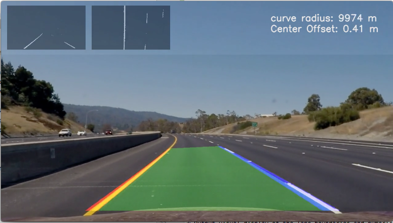


## Introduction


The goal of this project is to write a software pipeline to identify the lane boundaries in a video.
This is an "upgrade" to the first project on the methodology to detect lanes.

## Files:
- [`main.py`](main.py) : entry point to run the pipeline 
- [`utils.py`](utils.py) : python file with all the functions used in the pipeline
 
 
## Goals: 
The goals / steps of this project are the following:

* Compute the camera calibration matrix and distortion coefficients given a set of chessboard images.
* Apply a distortion correction to raw images.
* Use color transforms, gradients, etc., to create a thresholded binary image.
* Apply a perspective transform to rectify binary image ("birds-eye view").
* Detect lane pixels and fit to find the lane boundary.
* Determine the curvature of the lane and vehicle position with respect to center.
* Warp the detected lane boundaries back onto the original image.
* Output visual display of the lane boundaries and numerical estimation of lane curvature and vehicle position.


---

1. ### Camera Calibration

Geometric camera calibration, also referred to as camera resectioning, estimates the parameters of a lens and image sensor 
of an image or video camera. You can use these parameters to correct for lens distortion, measure the size of an object in 
world units, or determine the location of the camera in the scene. ([mathworks def](https://www.mathworks.com/help/vision/ug/camera-calibration.html))


[OpenCV](http://docs.opencv.org/2.4/modules/calib3d/doc/camera_calibration_and_3d_reconstruction.html) provides functions
 to perform this calibration. cv2.findChessboardCorners(image, pattern_size) can be used to find the calibration patterns 
 (it finds checkboard patterns in images). Once we have those parameters for several images, we can do the calibration with
  [cv2.calibrateCamera()](http://docs.opencv.org/3.0-beta/doc/py_tutorials/py_calib3d/py_calibration/py_calibration.html).
  It returns, among other values, the cameraMatrix, and the distortion coefficients, which are used to undistort further 
  images collected from the same camera.

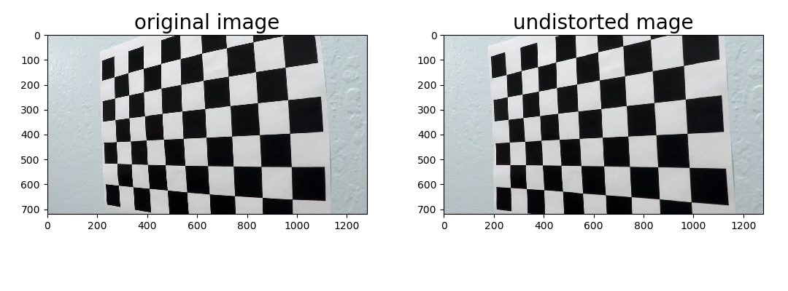

2. ### Apply a distortion correction to raw images

The Calibration parameters from above can be used with  the function [cv2.undistort()](http://docs.opencv.org/2.4/modules/imgproc/doc/geometric_transformations.html)
to correct the distortion of raw images. Here's an example of a raw image (left), and a corrected image, using the calibration parameters
from the camera calibration:

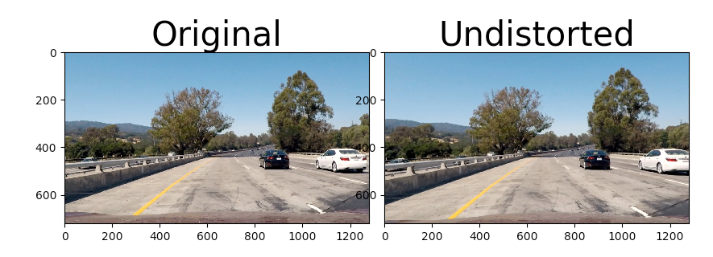


3. ### Use color transforms, gradients, etc., to create a thresholded binary image.

Different color representations / channels provide better detection of different colors. Below, an image is broken down into
the invididual channels of RBG, HSV, and LAB representations. I chose the B channel of LAB to capture the yellow line, while
and a gray RGB image (all channels) to capture the white line. 
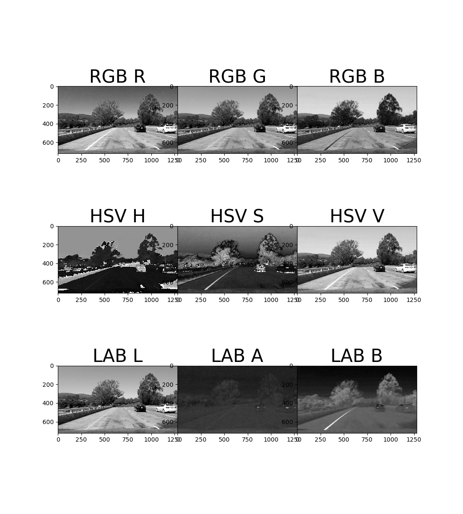

In my pipeline, the undistorted image was thresholded (select pixels within certain range) + binarized in RGB(gray) and LAB/B  channels. 
Pixel Coordinates were added to the output image if they were present (value 1 in binary image) in both images.

In my code, the pre-process_image takes an image, and trapezoid coordinates for a mask, to limit the region where seaching for lines. The image is thresholded/binarized in each channel, and
both outputs are combined, with the mask, to produce an image as such:
<br>
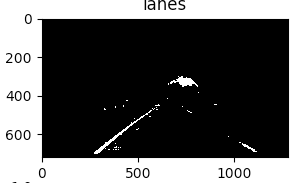
<b>

```python
mask = np.array([[(imshape[1] / 8, imshape[0]), (2 * imshape[1] / 6, 2 * (imshape[0] / 5)),
                                   (7 * imshape[1] / 12, 2 * (imshape[0] / 5)), ((11 * imshape[1] / 12), imshape[0])
                                   ]], dtype=np.int32)
                                   
combined_binary_masked = (b_cv2.threshold(cv2.cvtColor(image, cv2.COLOR_RGB2LAB)[:, :, 2], 160, 255, cv2.THRESH_BINARY) | cv2.threshold(cv2.cvtColor(image, cv2.COLOR_RGB2GRAY), 200, 255, cv2.THRESH_BINARY)) & mask
```

4. ### Apply a perspective transform to rectify binary image ("birds-eye view").

My function perspective_unwarp(image_binary, src, dst) performs the perspective transformation. It takes as arguments the thresholded image, and the source and destination points for unwarping
it returns a birds-eye view of the image, obtained with the following cv functions:


```python
  cv2.warpPerspective(img, cv2.getPerspectiveTransform(src, dst), img.shape[::-1], flags=cv2.INTER_LINEAR)
```

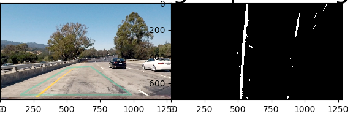
- Legend:
    - left: points to get perspective transformation matrix
    - right: birds-eye view (perspective transformation) of original image

5.  ### Detect lane pixels and fit to find the lane boundary.
    To get the pixels "ab initio", we can take an histogram at the bottom of the image, do peak detection (e.g. with the find_peaks_cwt function scipy.signal). Find the center of mass (scipy.ndimage.measurements.center_of_mass function comes in handy),
    and designate a new search box above. Get the center of mass of the new box, define new search box above, and repeat n times until the whole vertical axis is covered.
    
    we then find all the pixels with value 1 in the binary image that fall within the search boxes, and fit a quadradic function to define the curve.
    
    On subsquent images, one can use the fitted curve to define a search area (within a +- margin above and below the line), find the positive pixels, and re-fit the curve.
    
    Howver, due to lack of time, I did not implement the seconf approach. In my video processing pipeline, all images are blindly searched.
    
    I also used a Line class to keep track of the curve fitting coefficients, calculating the median over the last 10 images in order to smooth the curve and avoid jittering.
    
Left and right line pixel search rectangles:
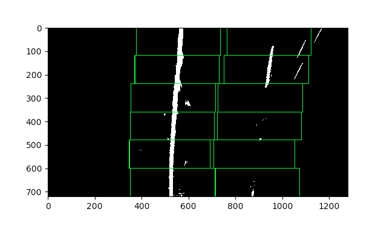
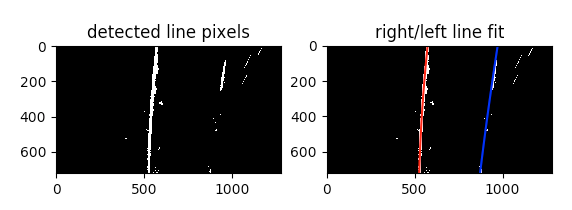

6. ###  Determine the curvature of the lane and vehicle position with respect to center.

The radius of the curve is calculated with the following formula:

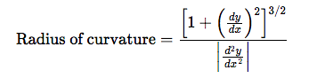

Given the line fit formular
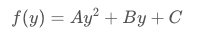

Curvature can be calculated as:
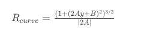


- To do this calculation, the lane lines are refitted in inverted x, y - coordinates, which care recalculated from the binary lane line images.
An optimization to the code could be to keep track of this in the initial line fitting.
With the new line fits, the coefficients are plugged into the formula above to calculcare the curvature (see calculate_curvature_and_deviation() in my code).
An optimization would be to calculate the curve over the media of the last n frames, similarly to how the lane drawing is performed, to avoid the crazy variation in the curvatrue numbers from frame to frame.

- The offset from the center is calculated as the difference between the midpoint of the image, and the average position of the two lane lines, at the bottom of the image


7. ### Provide an example image of your result plotted back down onto the road such that the lane area is identified clearly.


The detected lanes were warped back into the original image. Additioanaly, lane curvature and deviation from center were written to the image.
Furthermore, I also annotated the top of the image with the detected lanes, both in the original perspective, and the transformed birds-eye view.

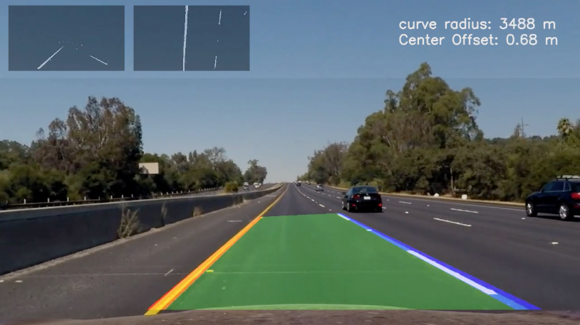


8. ### Pipeline (video)


YouTube link to my [video](https://youtu.be/xKqTzrqLJRc)


9. ### Pipeline (video)
The successful detection of the lanes depends on the successful detection of the lane Lines. Although the methodology in the project is an improvement over the first project, it's stull very prone to failure. Among other reason,the following cold represent serious problems:
- Detection depends on color thresholding, which could fail in less ideal conditions (night time, unfavorable light conditions, rain/fog), 
- Detection depends on lines. What if the lines simply do not exist?
- Detection depends on lines marking the road correctly. What if there are multiple overlapping lines, e.g. when traffic patterns change and new lines are painted over old but still visible lines
- Detection depends on lines marking the road correctly: What happens when the lane is subsquently interrupted due to construction.

Once lines are successfully detected, the remaining of the pipeline if robust to finish it's calculations. However, garbage in, garbage out surely applies here.
